# 校园通 (XiaoYuanTong) — 产品需求文档 (PRD)

> **文档版本**: v3.0 | **日期**: 2026-06-12 | **阶段**: Stage 2 — 需求定义 & 产品设计
> **关联文档**: [用户调研](./user-research.md) | [竞品分析](./competitive-analysis.md) | [低保真原型](../prototypes/wireframes.html)

---


---

## 执行摘要

### 产品定位

校园通是面向在校大学生的**校园本地信息聚合平台**。它以 **edu 邮箱认证**为信任锚点，将散落在微信群、QQ群、小红书、闲鱼、牛客中的五大校园需求——**校招内推、租房找房、二手交易、美食评测、考研考公**——聚合到一个结构化、可检索、校友背书的平台中。

> 一句话：**"大学生活的本地通"** — 校友身份背书，让每一条信息都来自真实同学。

**与竞品的核心差异**：现有产品要么是通用大平台（闲鱼/牛客/贝壳 — 无校园针对性），要么是即时通讯群（微信群/QQ群 — 无结构化）。校园通占据中间空白地带：**校园身份验证 × 五场景聚合 × 可检索沉淀**。

### 核心功能

| 模块 | MVP 核心功能 | 说明 |
|------|------------|------|
| 用户系统 | 手机号登录 + edu邮箱认证 | 认证后获得发布权限，显示学校+专业标签 |
| 校招内推 | 发布/浏览内推信息 + 面经经验 | 内推人学校专业可见，内推码一键复制 |
| 租房找房 | 发布/浏览出租房源 | 区域/价格/户型筛选，校友直租无中介费 |
| 二手交易 | 发布/浏览二手物品 + 分类筛选 | 书本/生活用品/非实体三大类，校内部面交 |
| 生活信息 | 发布/浏览美食推荐 + 星级评分 | 食堂档口级评测，评分可聚合 |
| 首页 | 五大模块信息流聚合 | 模块颜色标签区分，无限滚动 |

### 优先级

| 优先级 | 范围 | Sprint |
|:---:|------|:---:|
| **P0** | 用户系统(登录/认证) + 四大模块(发布/浏览/详情) + 首页信息流 | Sprint 1-3 |
| **P1** | 考研考公模块 · 专业×学院筛选 · 全局搜索 · 选课评价 · 合租匹配 · 收藏 | v1.1 |
| **P2** | 批量发布 · 表白墙 · 照片分享 · 通知系统 · 内容分享 · 租房攻略 | v1.2+ |

**MVP 冷启动路径**：美食推荐 + 二手交易(高频低门槛钩子) → 租房找房 + 校招内推(差异化留存) → 考研考公(扩场景)

---

## 目录

1. [项目背景与问题陈述](#1-项目背景与问题陈述)
2. [竞品格局与机会](#2-竞品格局与机会)
3. [产品概述](#3-产品概述)
4. [用户分析](#4-用户分析)
5. [用户故事地图](#5-用户故事地图)
6. [功能需求](#6-功能需求)
7. [非功能需求](#7-非功能需求)
8. [信息架构](#8-信息架构)
9. [页面设计](#9-页面设计)
10. [设计系统](#10-设计系统)
11. [低保真原型](#11-低保真原型)
12. [风险与假设](#12-风险与假设)
13. [成功指标](#13-成功指标)
14. [MVP 范围与发布计划](#14-mvp-范围与发布计划)
15. [术语表](#15-术语表)

---

## 1. 项目背景与问题陈述

### 1.1 背景

华北理工大学作为河北省重点高校，在校学生涵盖本科、硕士、博士三个层次。大学期间，每个学生都反复经历以下场景：找工作需要内推和面经、租房需要避开中介和虚假房源、毕业季需要快速出清闲置、日常需要知道哪个食堂好吃、考研考公需要真实经验而非机构软文。

这些需求天然发生在一个**高密度、高信任**的校园社交网络中——同校学生之间天然存在信任基础，校友之间愿意互相帮助。但现状是，没有一个平台把这种信任关系转化为结构化的信息基础设施。

### 1.2 问题陈述

**核心问题**：校园信息流转依赖微信/QQ 群等非结构化渠道，导致信息分散、不可检索、无法沉淀。

具体表现在五个场景：

| 场景 | 现状 | 核心痛点 |
|------|------|----------|
| 校招内推 | 内推码在群里泛滥，真假难辨；面经散落在牛客/知乎/小红书 | 内推信息缺乏校友身份背书，求职者无法判断可靠性 |
| 租房找房 | 58同城虚假房源泛滥；豆瓣小组信息混乱；曹妃甸校区周边周边房东不使用主流平台 | 真实房源被淹没；校友退租房源无有效流转渠道；合租匹配靠口头描述 |
| 二手交易 | 闲鱼面向全社会，混杂专业卖家；毕业季批量出清效率极低 | 校园身份无法验证；大件物品跨城邮寄成本高；教材循环无匹配机制 |
| 生活信息 | 食堂好不好吃、哪个外卖靠谱——靠微信群口口相传；大众点评在曹妃甸校区周边几乎无覆盖 | 小微信息无结构化沉淀；新生每年重复踩坑；选课靠私聊打听 |
| 考研考公 | 机构营销帖充斥知乎/小红书；目标院校内部情报极度隐蔽 | 真假难辨；精准情报获取靠私域（QQ群/私聊），公开渠道找不到 |

**共同根因**：缺少一个以**校园身份验证**为信任锚点的信息聚合平台。现有方案要么是通用大平台（无校园针对性），要么是聊天群（无结构化），两者之间存在明显的产品空白。

---

## 2. 竞品格局与机会

### 2.1 竞品矩阵

```
                    信息真实性 (校园身份背书)
                         ↑
                         |
          校园通 ●       |       牛客/贝壳/闲鱼
       (校园背书 × 5场景) |      (大平台 × 单场景)
                         |
     ————————————————————+————————————————————→ 场景覆盖面
                         |
       高校BBS/QQ群       |       小红书/知乎
    (局部 × 多场景)       |      (大平台 × 泛场景)
                         |
                         ↓
                     信息结构化
```

### 2.2 关键发现

1. **无人占据"校园全生命周期信息平台"定位** — 牛客只做求职、贝壳只做租房、闲鱼只做二手，五个场景在现有产品中是割裂的
2. **校园身份验证是全行业空白** — 所有头部平台均无校园认证机制，学生信任靠"熟人推荐"和"线下核验"弥补
3. **58同城/大众点评在曹妃甸校区周边失效** — 曹妃甸校区周边周边商家不入驻大众点评，房东不使用58同城；校园墙（QQ空间/微信号）是实际上的信息基础设施，但它格式混乱、无法检索、24小时被淹没
4. **考研考公人群持续膨胀** — 2025年考研报名388万、国考报名340万，备考群体对真实经验的需求极度旺盛
5. **小红书存在降维打击风险** — 已是大学生获取生活信息的第一站，若推出"校园频道+校园认证"将直接冲击

### 2.3 差异化策略

| 维度 | 校园通做法 | vs. 竞品 |
|------|-----------|----------|
| 信任 | edu邮箱认证 + 发布者学校专业可见 | 竞品无校园身份层 |
| 聚合 | 五大场景一站覆盖 | 竞品各自垂直 |
| 结构化 | 攻略/评测/经验可分类检索 | QQ群/微信群无法检索 |
| 校友网络 | 同校+同城双维度信息流转 | 无竞品做校友信息匹配 |

---

## 3. 产品概述

### 3.1 产品愿景

校园通是一个**校园本地信息聚合平台**，以校园身份验证为核心信任基础设施，一站式覆盖大学生从入学到毕业的五大核心场景。

**一句话定位**：大学生活的"本地通"——用校友身份背书，让信息真实可信。

### 3.2 核心价值主张

| 维度 | 价值 |
|------|------|
| 信任 | edu 邮箱认证，告别匿名虚假信息 |
| 聚合 | 五大场景一站聚合，不需切换 10+ 个 App |
| 结构化 | 信息可检索、可沉淀，不是聊天记录 |
| 校友网络 | 同校+同城双维度信任链 |

### 3.3 产品边界

**做什么**：
- 信息发布与浏览（五大场景）
- 校园身份验证（edu 邮箱认证）
- 结构化内容沉淀（攻略、评测、经验可分类检索）
- 校友间信息撮合（内推连接、合租匹配、考友匹配）

**不做什么**：
- 不做题库系统（牛客/粉笔壁垒高）
- 不做即时通讯（不替代微信/QQ）
- 不做自营租赁（不自持房源）
- 不做支付闭环（交易走线下）
- 不做 AI 内容生成（初期保持轻量）

---

## 4. 用户分析

### 4.1 用户角色

| 角色 | 描述 | 核心权限 |
|------|------|----------|
| 游客 | 未注册用户 | 浏览所有公开内容 |
| 普通用户 | 已注册但未验证校园身份 | 浏览 + 收藏 |
| 认证学生 | 已验证校园身份的在校生 | 浏览 + 发布 + 互动 |
| 认证校友 | 已验证校园身份的毕业生 | 同认证学生（发布内推、出租） |
| 管理员 | 平台内容审核人员 | 内容审核、举报处理 |

### 4.2 目标用户画像

| 维度 | 描述 |
|------|------|
| 年龄 | 18-28 岁 |
| 身份 | 本科生、硕士/博士研究生、应届毕业生 |
| 地域 | 华北理工大学（曹妃甸校区为主） |
| 技术素养 | 高：熟练使用移动互联网产品 |
| 消费特征 | 预算有限但消费意愿不低；价格敏感 |
| 社交特征 | 强校园归属感，信任同校/同城学生 |

### 4.3 用户生命周期与场景映射

```
入学 → 生活信息消费 → 二手循环买卖 → 考研考公/关注求职 → 深度求职 + 租房 → 毕业出清
  |                                                                              |
  +—————— 4 年（本科）或 6-7 年（本硕）的用户生命周期 ———————————————————————————+
```

> 详细人物画像见 [用户调研报告](./user-research.md)

---

## 5. 用户故事地图

### 5.1 故事地图结构

横轴为用户旅程五阶段，纵轴为六大模块。以下按 Epic 列出 MVP 用户故事。

#### Epic 0: 用户系统

| ID | 旅程 | 用户故事 | 验收标准 | 优先级 |
|----|------|---------|----------|:---:|
| US-U01 | 发现 | 作为**游客**，我用手机号注册/登录，获得发布权限 | 输入手机号→验证码→登录成功；新用户自动注册 | P0 |
| US-U02 | 发布 | 作为**已登录用户**，我认证校园身份(edu邮箱)，获得认证标识 | 选择学校→输入edu邮箱→邮件验证→认证成功 | P0 |
| US-U03 | 管理 | 作为**认证用户**，我查看个人主页，管理信息和发布历史 | 显示头像、昵称、学校、专业、认证标识、发布列表 | P1 |
| US-U04 | 管理 | 作为**用户**，我收藏感兴趣的内容，稍后查看 | 各模块详情页可收藏；收藏夹按模块分类 | P2 |

#### Epic 1: 校招内推

| ID | 旅程 | 用户故事 | 验收标准 | 优先级 |
|----|------|---------|----------|:---:|
| US-C01 | 浏览 | 作为**求职学生**，我浏览内推信息列表，发现内推机会 | 列表按时间倒序；显示公司、岗位、内推人(学校+专业)、有效期 | P0 |
| US-C02 | 发布 | 作为**认证校友**，我发布内推信息，帮学弟学妹内推 | 表单含公司、岗位、内推码、描述、有效期 | P0 |
| US-C03 | 浏览 | 作为**求职学生**，我浏览面经/笔试经验，准备面试 | 列表显示公司、岗位、面试轮次、是否通过 | P0 |
| US-C04 | 发布 | 作为**认证学生**，我发布面经经验，帮助后来者 | 表单含公司、岗位、轮次、真题回忆、经验正文 | P0 |
| US-C05 | 浏览 | 作为**求职学生**，我查看内推/面经详情，获取完整信息 | 详情页展示全部字段 + 发布者信息卡片 + 收藏/举报 | P1 |
| US-C06 | 互动 | 作为**求职学生**，我复制内推码，前往官网投递 | 详情页一键复制内推码 | P1 |
| US-C07 | 浏览 | 作为**求职学生**，我按专业×学院筛选内推信息 | 学院下拉→专业联动；仅展示匹配结果 | P1 |
| US-C08 | 管理 | 作为**发布者**，我标记内推已截止 | 已发布内推可标记"已截止"/"已招满" | P2 |

#### Epic 2: 租房找房

| ID | 旅程 | 用户故事 | 验收标准 | 优先级 |
|----|------|---------|----------|:---:|
| US-R01 | 浏览 | 作为**找房学生**，我浏览出租房源列表，找到合适住房 | 列表显示标题、区域、月租金、户型、缩略图 | P0 |
| US-R02 | 发布 | 作为**认证用户**，我发布出租信息，找到租客 | 表单含标题、区域、租金、户型、面积、照片(<=9张)、描述 | P0 |
| US-R03 | 浏览 | 作为**找房学生**，我查看房源详情，做出租房决策 | 图片轮播、完整信息、发布者信息卡片 | P1 |
| US-R04 | 浏览 | 作为**找房学生**，我按区域/价格/户型筛选房源 | 搜索框 + 筛选项联动 | P1 |
| US-R05 | 互动 | 作为**找房学生**，我收藏/联系房东 | 收藏按钮 + 查看联系方式 | P1 |
| US-R06 | 发布 | 作为**找房学生**，我发布合租需求，找室友 | 结构化表单：预算、性别、作息、吸烟、宠物 | P2 |
| US-R07 | 管理 | 作为**发布者**，我标记房源已出租 | 已发布房源可标记"已出租"/"已过期" | P2 |

#### Epic 3: 二手交易

| ID | 旅程 | 用户故事 | 验收标准 | 优先级 |
|----|------|---------|----------|:---:|
| US-S01 | 浏览 | 作为**学生**，我浏览二手物品列表，淘便宜好物 | 列表显示标题、分类标签、价格、缩略图、校区 | P0 |
| US-S02 | 发布 | 作为**认证学生**，我发布二手物品，卖出闲置 | 表单含分类、标题、价格(可免费)、描述、照片(<=9张)、校区 | P0 |
| US-S03 | 浏览 | 作为**学生**，我查看物品详情，决定是否购买 | 图片轮播、完整信息、发布者卡片 | P1 |
| US-S04 | 浏览 | 作为**学生**，我按分类筛选(书本/生活用品/非实体) | 三大类Tab切换筛选 | P1 |
| US-S05 | 互动 | 作为**学生**，我收藏/联系卖家 | 收藏按钮 + 查看联系方式 | P1 |
| US-S06 | 发布 | 作为**毕业班学生**，我批量发布物品，快速出清 | 连续添加多个物品，每物品1图+标题+分类+价格 | P2 |
| US-S07 | 管理 | 作为**发布者**，我标记物品已售/已出 | 物品状态：已售/已出/已预定 | P1 |

#### Epic 4: 生活信息

| ID | 旅程 | 用户故事 | 验收标准 | 优先级 |
|----|------|---------|----------|:---:|
| US-L01 | 浏览 | 作为**学生**，我浏览美食推荐列表，发现校园美食 | 列表显示标题、餐厅名、评分星、缩略图 | P0 |
| US-L02 | 发布 | 作为**认证学生**，我发布美食推荐，分享探店体验 | 表单含餐厅名、评分(1-5星)、照片(<=9张)、评论文本 | P0 |
| US-L03 | 浏览 | 作为**学生**，我查看美食详情，了解餐厅口碑 | 图片轮播、评分可视化、评论文本、同餐厅聚合入口 | P1 |
| US-L04 | 浏览 | 作为**选课学生**，我浏览选课评价，选课决策参考 | 课程名、教师、难度/给分评分、点名频率 | P1 |
| US-L05 | 发布 | 作为**认证学生**，我发布选课评价 | 难度(1-5)、给分(1-5)、点名频率、作业量、评价正文 | P1 |
| US-L06 | 浏览 | 作为**学生**，我浏览表白墙/吐槽/照片分享 | 列表浏览；表白墙支持匿名 | P2 |
| US-L07 | 发布 | 作为**学生**，我匿名发表白帖 | 可选匿名或实名 | P2 |

#### Epic 5: 考研考公上岸 (v1.1+)

| ID | 旅程 | 用户故事 | 验收标准 | 优先级 |
|----|------|---------|----------|:---:|
| US-E01 | 浏览 | 作为**备考学生**，我浏览上岸经验，参考真实备考策略 | 列表显示目标院校/岗位、本科院校、专业、分数 | P1 |
| US-E02 | 发布 | 作为**上岸校友**，我发布备考经验 | 类别、本科/目标院校、专业、各科分数、经验正文 | P1 |
| US-E03 | 浏览 | 作为**备考学生**，我按院校×专业筛选经验帖 | 目标院校→目标专业双维度筛选 | P2 |
| US-E04 | 互动 | 作为**备考学生**，我找同目标考友互相监督 | 发布考友需求 + 浏览匹配列表 | P2 |

#### Epic 6: 通用功能

| ID | 旅程 | 用户故事 | 验收标准 | 优先级 |
|----|------|---------|----------|:---:|
| US-G01 | 发现 | 作为**游客/用户**，首页看到聚合信息流，一站式浏览 | 信息流按时间倒序；每卡片含模块颜色标签 | P0 |
| US-G02 | 发现 | 作为**用户**，我跨模块全局搜索内容 | 搜索结果按模块分组展示 | P1 |
| US-G04 | 互动 | 作为**用户**，我举报违规内容 | 三点菜单→举报→选择类型→提交 | P1 |
| US-G05 | 互动 | 作为**用户**，我收到通知(审核结果、收藏更新) | 消息Tab显示通知列表 | P2 |
| US-G06 | 互动 | 作为**用户**，我分享内容到微信/QQ | 生成分享链接/二维码 | P2 |

---

## 6. 功能需求

> 功能需求与第5章用户故事一一对应。以下按模块列出，ID 与用户故事 ID 前缀一致，以便交叉引用。

### 6.1 用户系统

| ID | 功能 | 优先级 | 说明 |
|----|------|:---:|------|
| F-U01 | 手机号注册/登录 | P0 | 短信验证码登录，首次自动注册 |
| F-U02 | 校园身份认证 | P0 | edu 邮箱验证码验证；认证后显示学校+专业标签 |
| F-U03 | 个人主页 | P1 | 头像、昵称、学校、专业、认证标识、历史发布 |
| F-U04 | 个人设置 | P1 | 修改昵称/头像、通知偏好 |
| F-U05 | 收藏夹 | P2 | 按模块分类收藏 |

### 6.2 校招内推

| ID | 功能 | 优先级 | 说明 |
|----|------|:---:|------|
| F-C01 | 浏览内推信息列表 | P0 | 列表项：岗位、公司、内推人(学校+专业)、有效期 |
| F-C02 | 发布内推信息 | P0 | 需认证；公司、岗位、内推码、描述、有效期 |
| F-C03 | 浏览面经/笔试经验 | P0 | 列表项：标题、公司、岗位、轮次、是否通过 |
| F-C04 | 发布面经/笔试经验 | P0 | 需认证；公司、岗位、轮次、真题回忆、经验正文 |
| F-C05 | 内推/面经详情页 | P1 | 完整信息 + 发布者卡片 + 收藏/举报/复制内推码 |
| F-C06 | 按专业×学院筛选 | P1 | 学院下拉→专业联动；特色筛选 |
| F-C07 | 校招内容搜索 | P1 | 全文搜索公司名、岗位名、关键词 |
| F-C08 | 内推状态标记 | P2 | 发布者标记"已截止"/"已招满" |
| F-C09 | 技能学习内容 | P2 | 简历优化、笔试技巧、面试技巧、行业入门 |

### 6.3 租房找房

| ID | 功能 | 优先级 | 说明 |
|----|------|:---:|------|
| F-R01 | 浏览出租房源列表 | P0 | 列表项：标题、区域、月租金、户型、缩略图 |
| F-R02 | 发布出租信息 | P0 | 需认证；标题、区域、小区、租金、户型、面积、照片(<=9张)、描述 |
| F-R03 | 房源详情页 | P1 | 图片轮播、完整信息、发布者卡片 |
| F-R04 | 房源搜索与筛选 | P1 | 搜索框 + 区域/价格/户型筛选 |
| F-R05 | 合租匹配 | P2 | 浏览/发布结构化合租需求（预算、性别、作息等） |
| F-R06 | 租房攻略 | P2 | 合同注意事项、避坑清单、区域租金参考 |
| F-R07 | 房源状态管理 | P2 | 发布者标记"已出租"/"已过期" |

### 6.4 二手交易

| ID | 功能 | 优先级 | 说明 |
|----|------|:---:|------|
| F-S01 | 浏览二手物品列表 | P0 | 列表项：标题、分类标签、价格、缩略图、校区 |
| F-S02 | 发布二手信息 | P0 | 需认证；分类、标题、价格(可免费)、描述、照片(<=9张)、校区 |
| F-S03 | 物品详情页 | P1 | 图片轮播、完整信息、发布者卡片 |
| F-S04 | 分类筛选 | P1 | 三大类Tab：书本 / 生活用品 / 非实体 |
| F-S05 | 二手物品搜索 | P1 | 全文搜索物品名、描述 |
| F-S06 | 物品状态管理 | P1 | 发布者标记"已售"/"已出"/"已预定" |
| F-S07 | 批量发布 | P2 | 毕业季：连续添加多个物品(1图+标题+分类+价格) |

### 6.5 生活信息交流

| ID | 功能 | 优先级 | 说明 |
|----|------|:---:|------|
| F-L01 | 浏览美食推荐列表 | P0 | 列表项：标题、餐厅名、评分(1-5星)、缩略图 |
| F-L02 | 发布美食推荐 | P0 | 需认证；餐厅名、档口号(选)、评分、照片(<=9张)、评论文本 |
| F-L03 | 美食详情页 | P1 | 图片轮播、评分可视化、评论文本、同餐厅聚合入口 |
| F-L04 | 餐厅/档口聚合页 | P2 | 同一餐厅所有评价、平均评分 |
| F-L05 | 浏览选课评价 | P1 | 列表项：课程名、教师、难度/给分评分、点名频率 |
| F-L06 | 发布选课评价 | P1 | 需认证；难度(1-5)、给分(1-5)、点名频率、作业量、评价正文 |
| F-L07 | 表白墙/吐槽/照片 | P2 | 列表浏览 + 发布；表白墙支持匿名 |

### 6.6 考研考公上岸 (v1.1+)

| ID | 功能 | 优先级 | 说明 |
|----|------|:---:|------|
| F-E01 | 浏览上岸经验列表 | P1 | 列表项：目标院校/岗位、本科院校、专业、分数 |
| F-E02 | 发布上岸经验 | P1 | 需认证；类别、本科/目标院校、专业、各科分数、经验正文 |
| F-E03 | 按院校×专业筛选 | P2 | 目标院校→目标专业双维度筛选 |
| F-E04 | 备考资料流转 | P2 | 浏览/发布二手资料（教材/笔记/真题） |
| F-E05 | 考友匹配 | P2 | 发布需求 + 浏览匹配列表 |
| F-E06 | 院校情报库 | P2 | 报录比、分数线趋势、复试风格 |

### 6.7 通用功能

| ID | 功能 | 优先级 | 说明 |
|----|------|:---:|------|
| F-G01 | 首页信息流 | P0 | 五大模块最新内容聚合，模块颜色标签区分 |
| F-G02 | 全局搜索 | P1 | 跨模块全文搜索，结果按模块分组 |
| F-G04 | 内容举报 | P1 | 三点菜单→举报→类型选择→提交 |
| F-G05 | 通知系统 | P2 | 审核结果、收藏更新、(后期)评论回复 |
| F-G06 | 内容分享 | P2 | 分享链接/二维码 |

---

## 7. 非功能需求

| ID | 类别 | 需求 | 优先级 |
|----|------|------|:---:|
| NF01 | 性能 | 首页 LCP <= 2s，列表页 TTI <= 1.5s，图片懒加载 | P0 |
| NF02 | 响应式 | 移动端优先：375px-768px 适配；PC 端(>=1024px)双栏布局 | P0 |
| NF03 | 安全 | 短信防刷；XSS 过滤；参数化查询防注入；图片格式/大小校验 | P0 |
| NF04 | 可用性 | 核心任务(浏览→详情 / 发布→提交) <= 3 次点击 | P0 |
| NF05 | 内容质量 | 发布需校园认证；游客/未认证只能浏览 | P1 |
| NF06 | 可靠性 | 核心 API 可用性 >= 99.5%；上传失败可重试 | P1 |
| NF07 | 可扩展 | 模块化代码结构；新增内容类型 1 周内可接入 | P1 |
| NF08 | SEO | 面经、攻略、房源等长尾内容搜索引擎可索引 | P2 |
| NF09 | 无障碍 | 图片 alt 文本；色彩对比度 >= WCAG AA | P2 |

## 8. 信息架构

### 8.1 站点结构

```mermaid
graph TD
    HOME["🏠 首页 · 信息流聚合"]
    CAREER["💼 校招内推"]
    RENTAL["🏠 租房找房"]
    SECONDHAND["🔄 二手交易"]
    LIFE["🎯 生活信息"]
    EXAM["📚 考研考公 (v1.1)"]
    PROFILE["👤 我的"]

    HOME --> CAREER
    HOME --> RENTAL
    HOME --> SECONDHAND
    HOME --> LIFE
    HOME --> EXAM

    CAREER --> C1["内推信息"]
    CAREER --> C2["面经/笔试"]
    CAREER --> C3["实习信息 (v1.1)"]
    CAREER --> C4["技能学习 (v1.2)"]

    RENTAL --> R1["出租房源"]
    RENTAL --> R2["合租匹配 (v1.1)"]
    RENTAL --> R3["租房攻略 (v1.2)"]

    SECONDHAND --> S1["全部"]
    SECONDHAND --> S2["书本"]
    SECONDHAND --> S3["生活用品"]
    SECONDHAND --> S4["非实体交易"]

    LIFE --> L1["美食推荐"]
    LIFE --> L2["选课评价 (v1.1)"]
    LIFE --> L3["表白墙 (v1.2)"]
    LIFE --> L4["吐槽/趣事 (v1.2)"]
    LIFE --> L5["照片分享 (v1.2)"]

    EXAM --> E1["考研"]
    EXAM --> E2["考公"]

    PROFILE --> P1["个人主页"]
    PROFILE --> P2["我的发布"]
    PROFILE --> P3["收藏夹 (v1.2)"]
    PROFILE --> P4["设置"]

    C1 --> CD1["内推详情页"]
    C2 --> CD2["面经详情页"]
    R1 --> RD1["房源详情页"]
    S1 --> SD1["物品详情页"]
    S2 --> SD1
    S3 --> SD1
    S4 --> SD1
    L1 --> LD1["美食详情页"]
    E1 --> ED1["经验详情页"]
    E2 --> ED1
```



### 8.2 导航结构

**移动端 — 底部 Tab 栏（始终可见）**：

```
Tab:  [🏠 首页]  [💼 求职]  [➕ 发布]  [🔔 消息]  [👤 我的]
```

**设计决策说明**：底部不放全部 5 个模块入口，原因是：(1) 5+ Tab 过窄导致触控命中率下降；(2) "求职"单独占 Tab 因其在校招季(8-11月,2-4月)使用频率极高；(3) 租房/二手/生活通过首页模块 Tab 和卡片入口触达；(4) "发布"居中凸起，强化贡献行为引导。

**首页模块 Tab**（首页顶部横向滑动）：`[全部] [校招内推] [租房找房] [二手交易] [生活信息]`

**PC 端 (>=1024px)**：左侧固定边栏（首页/校招/租房/二手/生活/考研/我的）+ 顶部搜索栏 + 右侧内容区，信息流为双栏瀑布布局。

### 8.3 页面层级关系

```
L1 (入口)    首页 · 求职 · 发布选择 · 消息 · 我的
L2 (列表)    内推列表 / 房源列表 / 物品列表 / 美食列表 / 经验列表
L3 (详情)    内推详情 / 房源详情 / 物品详情 / 美食详情 / 经验详情
L4 (操作)    发布表单 / 举报弹窗 / 收藏确认
```

---

## 9. 页面设计

> 以下为 5 类核心页面的布局规格。详细交互行为见"交互说明"小节。低保真可交互原型见 [prototypes/wireframes.html](../prototypes/wireframes.html)。

### 9.1 首页

```
┌──────────────────────────────────────────┐
│ 🏫 校园通          [▽ 浙江大学]  🔍     │  ← 顶部栏(48px)
├──────────────────────────────────────────┤
│ [全部] [校招] [租房] [二手] [生活]       │  ← 模块Tab(40px,横向滑动)
├──────────────────────────────────────────┤
│ ┌──────────────────────────────────────┐ │
│ │ 🔴 二手  数据结构教材  ￥15    [📷] │ │  ← 卡片:模块色标签+标题
│ │          紫金港校区 · 2小时前       │ │     +描述+缩略图(右80×80)
│ └──────────────────────────────────────┘ │
│ ┌──────────────────────────────────────┐ │
│ │ 🟡 美食  食堂麻辣烫  ⭐4.2   [📷] │ │
│ │          汤底浓郁食材新鲜 · 3小时前 │ │
│ └──────────────────────────────────────┘ │
│ ┌──────────────────────────────────────┐ │
│ │ 🔵 校招  字节跳动后端内推           │ │
│ │          张三·计算机学院 · 5小时前  │ │
│ └──────────────────────────────────────┘ │
│            ... 无限滚动 ...               │
├──────────────────────────────────────────┤
│ [🏠首页] [💼求职] [➕] [🔔消息] [👤我的] │  ← 底部Tab(56px)
└──────────────────────────────────────────┘
```

**交互说明**：
- 模块 Tab：点击切换信息流内容范围；"全部"=所有模块混合
- 信息流卡片：点击进入对应详情页
- 底部"发布"按钮：点击弹出底部面板，选择模块后进入对应发布页
- 下拉刷新 + 上滑加载更多

### 9.2 列表页（以校招内推为例）

```
┌──────────────────────────────────────────┐
│ ← 返回          校招内推                │  ← NavBar(48px)
├──────────────────────────────────────────┤
│ [内推信息]  [面经/笔试]                  │  ← 子Tab(40px)
├──────────────────────────────────────────┤
│ 🔍 搜索公司/岗位...                      │  ← 搜索框(44px)
├──────────────────────────────────────────┤
│ 字节跳动 后端开发实习生                  │
│ 张三 · 计算机学院 · 有效期至6/30        │  ← 列表项(>=60px)
│ 2小时前                                  │    点击→详情页
│ ─────────────────────────────────────    │
│ 阿里巴巴 前端工程师校招                  │
│ 李四 · 软件学院                         │
│ 1天前                                   │
│ ─────────────────────────────────────    │
│            ... 无限滚动 ...               │
└──────────────────────────────────────────┘
```

**交互说明**：
- 子 Tab 切换：内推/面经 列表切换，数据独立请求
- 搜索框：输入后实时过滤列表（前端过滤或 debounce 请求）
- 列表项：整行可点击→进入详情页
- 筛选器（v1.1）：搜索框下方展开，学院下拉→专业联动

### 9.3 详情页（以二手物品为例）

```
┌──────────────────────────────────────────┐
│ ← 返回                        ⋯ 更多   │  ← NavBar
├──────────────────────────────────────────┤
│ ┌──────────────────────────────────────┐ │
│ │        图片轮播区 (260px)           │ │  ← 左右滑动,圆点指示器
│ │        ● ● ○ ○                       │ │
│ └──────────────────────────────────────┘ │
│                                          │
│ 🔴 二手 · 书本                          │  ← 分类标签
│                                          │
│ 几乎全新的数据结构教材                   │  ← 标题 H2
│                                          │
│ ￥15                                     │  ← 价格 H1,红色
│                                          │
│ 大三时候买的，基本没怎么翻过。          │  ← 描述 Body
│ 适合计算机专业同学参考使用。            │
│                                          │
│ 📍 交易地点：紫金港校区                 │  ← 位置
│                                          │
│ ───────────────────────────────────     │
│ ┌──────────────────────────────────────┐ │
│ │ 👤 王五                             │ │  ← 发布者卡片
│ │    浙江大学 · 计算机学院            │ │    圆角12px,浅灰底
│ │    ✓ 已认证学生                     │ │
│ └──────────────────────────────────────┘ │
├──────────────────────────────────────────┤
│   [☆ 收藏]        [📋 复制联系方式]    │  ← 底部操作栏(56px)
└──────────────────────────────────────────┘
```

**交互说明**：
- "⋯ 更多"：弹出菜单(收藏/举报/分享)
- 图片轮播：左右滑动切换，点击单图全屏预览
- 发布者卡片：点击进入该用户个人主页
- "复制联系方式"：点击→复制到剪贴板→toast 提示"已复制"
- "收藏"：点击切换实心/空心星；未登录→跳转登录

### 9.4 发布页（以美食推荐为例）

```
┌──────────────────────────────────────────┐
│ ✕ 取消      发布美食推荐      发布 →   │  ← NavBar
├──────────────────────────────────────────┤
│                                          │
│  餐厅/档口名 *                           │  ← 必填标注红色*
│  ┌──────────────────────────────────────┐│
│  │ 例：紫金港食堂三楼 重庆小面        ││  ← h=44px,8px圆角
│  └──────────────────────────────────────┘│
│                                          │
│  评分 *                                  │
│  ★★★★☆  (点击星星评分)                  │  ← 5星可点选,32×32px
│                                          │
│  添加照片 (最多9张)                      │
│  ┌──────┐ ┌──────┐ ┌──────┐            │
│  │  📷  │ │      │ │      │            │  ← 3列网格,100×100
│  │ 拍照 │ │      │ │      │            │
│  └──────┘ └──────┘ └──────┘            │
│                                          │
│  评价 *                                  │
│  ┌──────────────────────────────────────┐│
│  │ 说说这家店怎么样...                 ││  ← min 3行,自动扩展
│  │                                      ││
│  └──────────────────────────────────────┘│
│                                          │
└──────────────────────────────────────────┘
```

**交互说明**：
- "发布"按钮：必填项未填完时置灰不可点击；填完后变蓝可点击
- 点击 ✕ 或安卓返回键：弹出"放弃编辑？"确认弹窗
- 图片上传：首个格子为拍照入口；后续格子显示已选图片(可长按删除)
- 提交成功：跳转到对应详情页 + toast "发布成功"
- 提交失败：toast 错误提示，表单内容保留不清空

### 9.5 个人主页

```
┌──────────────────────────────────────────┐
│                             ⚙️ 设置     │  ← NavBar
│              ┌──────────┐                │
│              │   头像   │                │  ← 80×80px圆形
│              └──────────┘                │
│                                          │
│            张三  ✓ 已认证                │  ← 昵称+绿色认证标识
│            浙江大学 · 计算机学院         │
│                                          │
│       ┌──────────┐ ┌──────────┐         │
│       │    12    │ │    5     │         │  ← 统计数据
│       │  我的发布│ │  收藏    │         │
│       └──────────┘ └──────────┘         │
├──────────────────────────────────────────┤
│  [我的发布]  [收藏]                      │  ← 内容Tab
├──────────────────────────────────────────┤
│  🔴 二手  数据结构教材  ￥15            │
│           2天前 · 已发布                 │  ← 发布列表项
│  ─────────────────────────────────────  │
│  🔵 校招  字节跳动后端内推              │
│           5天前 · 已发布                 │
│  ─────────────────────────────────────  │
│            ... 无限滚动 ...               │
└──────────────────────────────────────────┘
```

**交互说明**：
- 头像：点击可更换(如有权限)
- 统计数据：点击"发布"数字→跳转到发布Tab；点击"收藏"→跳转收藏Tab
- 发布列表项：点击进入对应详情页；可左滑删除(确认弹窗)

---

## 10. 设计系统

### 10.1 色彩

| Token | 色值 | 用途 |
|-------|------|------|
| `--primary` | `#2563EB` | 主色：按钮、链接、选中态 |
| `--primary-light` | `#DBEAFE` | 主色浅底 |
| `--success` | `#16A34A` | 成功/认证标识 |
| `--danger` | `#DC2626` | 价格、错误、举报 |
| `--warning` | `#F59E0B` | 评分星星 |
| `--bg-page` | `#F3F4F6` | 页面背景 |
| `--bg-surface` | `#FFFFFF` | 卡片/输入框背景 |
| `--text-primary` | `#111827` | 主文字 |
| `--text-secondary` | `#6B7280` | 次要文字 |
| `--text-tertiary` | `#9CA3AF` | 占位符 |
| `--border` | `#E5E7EB` | 分割线/边框 |

**模块标签色**：校招蓝(`#2563EB`) · 租房绿(`#16A34A`) · 二手红(`#DC2626`) · 生活黄(`#F59E0B`) · 考研紫(`#7C3AED`)

### 10.2 字体

| 层级 | 字号/行高 | 字重 | 用途 |
|------|----------|------|------|
| H1 | 24px/32px | 600 | 页面大标题 / 价格 |
| H2 | 20px/28px | 600 | 详情页标题 |
| H3 | 16px/24px | 600 | 卡片标题、表单标签 |
| Body | 14px/20px | 400 | 正文、列表描述 |
| Caption | 12px/16px | 400 | 时间、辅助、标签 |

字体族：`"Inter", "Noto Sans SC", -apple-system, sans-serif`

### 10.3 圆角与间距

圆角：sm=6px(按钮/标签) · md=8px(输入框/卡片) · lg=12px(模态框) · full=999px(圆形标签/头像)
阴影：`--shadow-card: 0 1px 3px rgba(0,0,0,0.08)`
间距(4px基准)：xs=4px · sm=8px · md=12px · lg=16px · xl=24px

### 10.4 核心组件

| 组件 | 规格 |
|------|------|
| 大按钮 | 40px高, 14px/600, 6px圆角, Primary/Secondary/Ghost/Danger 四变体 |
| 小按钮 | 32px高, 12px/600 |
| 输入框 | 44px高, 8px圆角, 1px灰边框; Focus=蓝边框+蓝外发光; Error=红边框 |
| 标签 | 24px高, 全圆角, 12px/600, 模块色10%底+模块色字 |
| 星级 | 展示24px, 点击32px; 空星=#9CA3AF, 实星=#F59E0B |
| 卡片 | 8px圆角, 1px边框, 16px内边距, 12px间距 |

---

## 11. 低保真原型

HTML 线框图原型位于 [prototypes/wireframes.html](../prototypes/wireframes.html)，直接在浏览器打开即可查看。

覆盖 6 个关键屏幕：
1. **首页** — 信息流聚合 + 模块 Tab + 底部导航
2. **校招内推列表** — 子Tab + 搜索 + 列表项
3. **二手物品详情** — 图片轮播 + 结构化信息 + 发布者卡片 + 底部操作
4. **发布美食推荐** — 表单：餐厅名 + 星级评分 + 图片上传 + 文本域
5. **发布模块选择** — 底部弹出面板，四大模块入口
6. **个人主页** — 头像 + 认证标识 + 统计数据 + 发布列表

> 原型为低保真灰盒线框图，用于验证信息布局和交互流程。高保真交互原型将在阶段 3 完成。

---

## 12. 风险与假设

### 12.1 关键假设

| # | 假设 | 验证方式 | 影响 |
|---|------|----------|------|
| A1 | 学生愿意用 edu 邮箱完成校园身份认证 | MVP 阶段统计认证转化率；目标 >= 40% | 若认证率过低，发布侧内容量将无法增长 |
| A2 | 认证用户有足够意愿主动发布内容 | 统计认证用户中发布过内容的比例；目标 >= 25% | 若发布率低，需引入运营激励或 UGC 种子内容 |
| A3 | 校园信息在华北理工大学的网络效应可自驱动增长 | 观察日活和内容增长曲线 | 若无法自增长，需重新评估运营策略 |
| A4 | 校友（毕业生）愿意回来发布内推和租房信息 | 统计毕业生用户活跃度 | 若毕业即流失，校友网络效应不成立 |
| A5 | 用户接受手机号注册（非微信/QQ一键登录） | 注册漏斗转化率 | 若注册流失高，需优先接入微信登录 |

### 12.2 已识别风险

| # | 风险 | 概率 | 影响 | 缓解措施 |
|---|------|:---:|:---:|------|
| R1 | **冷启动困难**：首批用户内容生产不足 | 高 | 高 | 运营团队手动生产种子内容(美食评测50+条)；邀请校园KOL入驻 |
| R2 | **小红书推出校园频道**：形成降维打击 | 中 | 高 | 深耕校友网络和校园身份验证——这是小红书的弱项；快速建立差异化壁垒 |
| R3 | **校园墙运营者引入结构化工具**：低成本替代本产品 | 中 | 中 | 提供更好的信息沉淀和检索体验；校园墙无法做多场景聚合和结构化沉淀 |
| R4 | **用户毕业流失**：核心用户毕业后使用频率骤降 | 高 | 中 | 设计"校友"角色，保留内推/经验帖发布场景；校友可为在校生提供价值 |
| R5 | **季节性波动**：活跃度集中在开学季/毕业季/求职季 | 高 | 中 | 五大场景的季节性互补（求职8-11月+2-4月、租房5-9月、二手6-7月+9月、生活全年）；淡季运营活动 |
| R6 | **内容质量下降**：低质或虚假内容涌入 | 中 | 中 | 校园认证为发布门槛；举报+人工审核双机制；未来可引入AI辅助审核 |
| R7 | **商业化路径不清晰**：学生付费能力弱 | 中 | 低 | MVP 阶段不追求商业化；后续可探索精准广告(按学校/专业定向)、内推增值服务 |

---

## 13. 成功指标

### 13.1 北极星指标

**周活跃认证用户数 (WAU)** — 衡量校园通是否为认证学生提供了持续价值。所有其他指标服务于这个北极星。

### 13.2 关键指标

| 类别 | 指标 | MVP 目标(3个月) | 测量方式 |
|------|------|:---:|------|
| 用户增长 | 注册用户数 | >= 5000 | 后台统计 |
| 用户增长 | 校园认证率 | >= 40% | 认证用户/注册用户 |
| 用户活跃 | 周活跃认证用户 (WAU) | >= 1000 | 每周至少访问1次的认证用户 |
| 用户活跃 | 次日留存率 | >= 30% | 注册次日回访比例 |
| 内容生产 | 日均新增内容数 | >= 10 条（本校） | 后台统计 |
| 内容生产 | 认证用户发布率 | >= 25% | 至少发布1次的认证用户/总认证用户 |
| 内容消费 | 人均浏览内容数 | >= 8 条/天 | 埋点统计 |
| 内容消费 | 核心路径完成率 | >= 60% | 浏览→详情 或 打开发布→提交成功 |
| 内容质量 | 举报率 | <= 2% | 被举报内容/总内容 |
| 内容质量 | 虚假信息核实率 | 100%(48h内) | 运营处理时效 |

---

## 14. MVP 范围与发布计划

### 14.1 MVP (v1.0) 范围

| 模块 | MVP 包含 | MVP 不包含 |
|------|---------|------------|
| 用户系统 | 手机号登录/注册 · edu邮箱认证 · 个人主页 | 微信登录 · 收藏夹 · 学生证审核 |
| 校招内推 | 发布/浏览内推信息 · 面经经验 · 详情页 | 专业×学院筛选 · 技能学习 |
| 租房找房 | 发布/浏览出租房源 · 房源详情 · 基础筛选 | 合租匹配 · 租房攻略 · 地图 |
| 二手交易 | 发布/浏览物品 · 详情 · 分类筛选 · 状态管理 | 批量发布 |
| 生活信息 | 发布/浏览美食推荐 · 详情 | 选课评价 · 表白墙 · 照片分享 |
| 考研考公 | — | 全部延后 v1.1 |
| 通用 | 首页信息流 · 内容举报 | 全局搜索 · 通知 · 分享 |

### 14.2 冷启动策略

1. **美食推荐 + 二手交易** 作为冷启动钩子：频次最高、门槛最低、易产生自然传播
2. **租房找房 + 校招内推** 提供核心差异化价值：非来不可的理由
3. 首期聚焦 **华北理工大学**，深耕单校网络效应
4. 运营提前准备 **50+ 条种子美食评测**，确保首屏即有内容可消费

### 14.3 3-Sprint 发布计划

```
 Sprint 1 (2周)              Sprint 2 (2周)              Sprint 3 (2周)
┌──────────────────────┐ ┌──────────────────────┐ ┌──────────────────────┐
│ 基础架构 + 用户       │ │ 内容模块 MVP          │ │ 打磨 + 上线           │
│                      │ │                      │ │                      │
│ · 项目脚手架          │ │ · 校招内推 CRUD       │ │ · 首页信息流聚合      │
│ · DB Schema + Prisma  │ │ · 租房找房 CRUD       │ │ · 图片上传组件        │
│ · 登录/注册           │ │ · 二手交易 CRUD       │ │ · 举报功能            │
│ · 校园认证(edu邮箱)   │ │ · 美食推荐 CRUD       │ │ · 响应式适配          │
│ · 个人主页            │ │ · 通用列表/详情组件   │ │ · 种子内容导入     │
│ · 路由 + 导航框架     │ │ · 发布表单组件        │ │ · Bug修复 + 性能优化  │
│ · CI/CD 流水线        │ │ · API 对接            │ │ · 上线 + 监控         │
└──────────────────────┘ └──────────────────────┘ └──────────────────────┘
```

---

## 15. 术语表

| 术语 | 定义 |
|------|------|
| 校园通 | 产品名称，校园本地信息聚合平台 |
| edu 邮箱 | 教育机构邮箱(如 `@zju.edu.cn`)，用于校园身份认证 |
| 校园认证 | 通过 edu 邮箱验证或学生证审核，确认用户的校园身份 |
| 认证用户 | 已完成校园身份认证的用户，拥有发布权限 |
| 信息流 | 首页按时间倒序排列的内容卡片列表 |
| 模块 | 五大功能场景：校招内推、租房找房、二手交易、生活信息、考研考公 |
| 种子高校 | MVP 阶段首批覆盖的高校，用于验证产品与市场匹配 |
| 冷启动 | 产品从零用户到产生网络效应的初始阶段 |
| UGC | User-Generated Content，用户生产内容 |
| PGC | Professionally-Generated Content，官方/达人生产内容 |
| LCP | Largest Contentful Paint，网页最大内容渲染时间(性能指标) |
| TTI | Time to Interactive，页面可交互时间(性能指标) |
| MVP | Minimum Viable Product，最小可行产品(v1.0) |

---

*文档版本: v3.0 | 更新日期: 2026-06-12 | 阶段: Stage 2 — 需求定义 & 产品设计*
